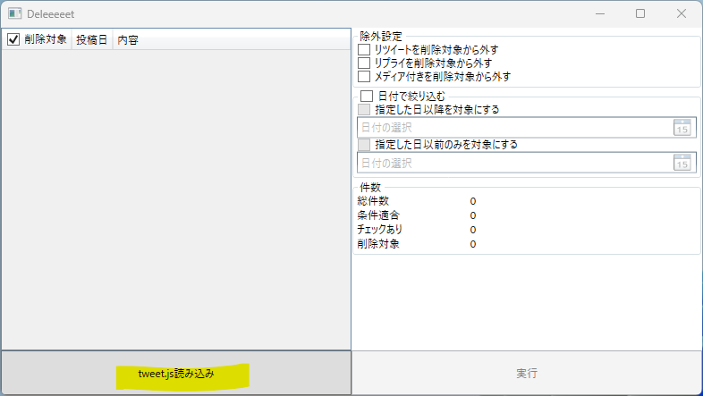
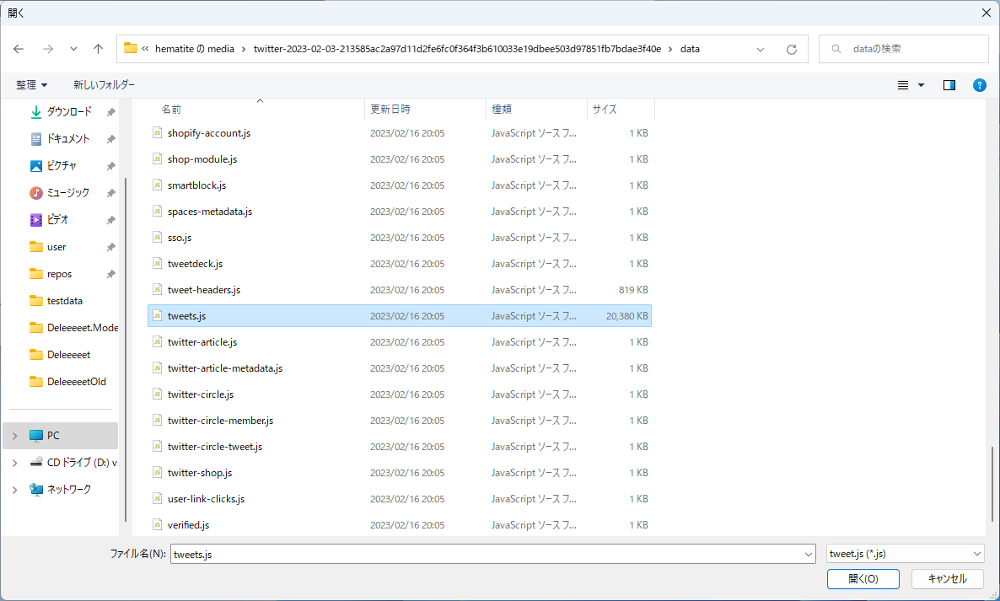
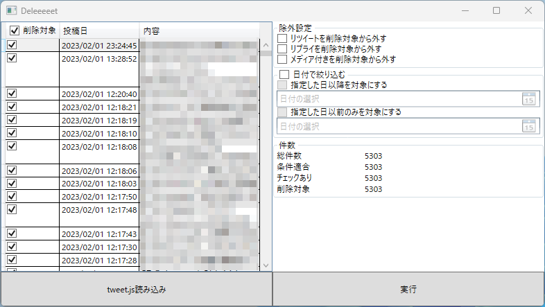
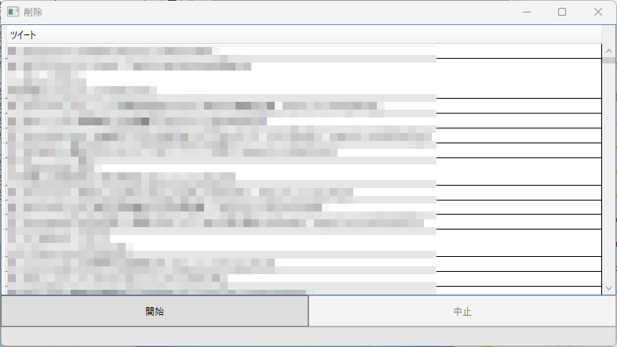

# Deleeeeet
## これは？
Twitterへの投稿を削除するツール

## 使い方
1. 事前準備
   1. ツイッターのアーカイブをダウンロードする
   2. アーカイブを展開する
2. 削除本番
   1. `Deleeeeet.exe` を実行する
   2. Twitterの認証を行う
   3. 準備しておいたアーカイブの中にある `data/tweets.js` を開く
      
      
   4. 消したいツイートを選ぶ
      
   5. 実行
   6. 開始
      

## 自分でビルドする人へ
TwitterのAPI Keyは同梱できないため空にしています。自分で取得して `SecretKey.json` に書き込んでください。

## ライセンス
MIT Licenseです。無保証です。
